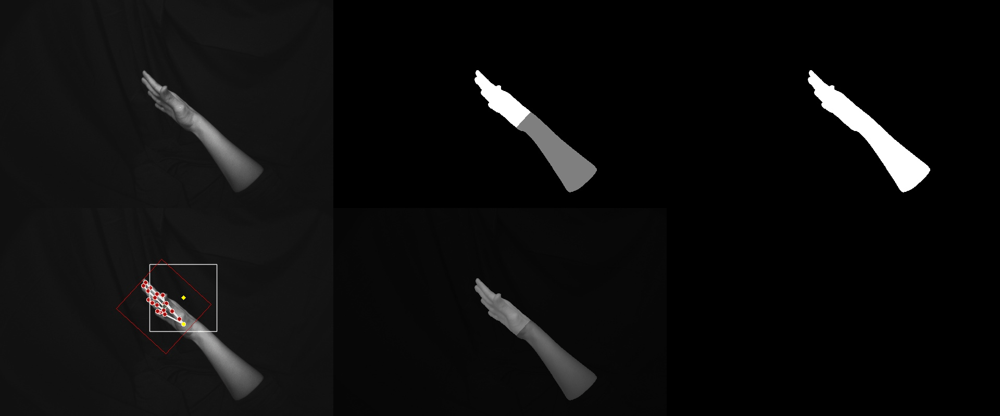

# HandMask_AutoLabel
A HandMask Autolabel Tool.

## Annotation 
[Hand_mask.json](annotations/sample.json)
### Info
| Item         | Value                    | Data_Type |
|--------------|--------------------------|-----------|
| description  | "CRI 2023 Hand Datasets" | str       |
| version      | "1.0.0"                  | str       |
| date         | "2023-01-30"             | str       |
| organization | "Coretronic_CRI"         | str       |
***
### images
| Item          | Value                                                                    | Data_Type |
|---------------|--------------------------------------------------------------------------|-----------|
| image_path    | "./images/person/Gid/fid.png"                                            | str       |
| id            | 123                                                                      | int       |
 | frame_id      | 123                                                                      | int       |
| camera        | id (Camera category)  retify (bool) width (int) height (int) |        |
***
### Mask
| Item      | Value                       | Data_Type |
|-----------|-----------------------------|-----------|
| mask_path | "./mask/person/Gid/fid.png" | str       |
| id        | 123                         | int       |
| frame_id  | 123                         | int       |
***
### camera
| Item       | Value                                                                                   | Data_Type |
|------------|-----------------------------------------------------------------------------------------|-----------|
| id         | 0:fisheye 1:pinhole  ...                                                        | int       |
| device     | "fisheye" "RealSense L515" ...                                                  | str       |
| intrinsic  | 278.08321774513394, 279.113841127447, 309.19580091877737, 207.67952497223772, 0.0       | float     |
| distortion | -0.020306250909190218, 0.056496479357930875, -0.06768354885591037, 0.036626224288176815 | float     |
***
### annotations
| Item                   | Value                      | Data_Type |
|------------------------|----------------------------|-----------|
| id                     | 123                        | int       |
| image_id               | 123                        | int       |
| mask_id                | 123                        | int       |
| frame_id               | 1                          | int       |
| left_hand_accessories  | False                      | bool      |
| right_hand_accessories | False                      | bool      |
| left_arm_accessories   | False                      | bool      |
| right_arm_accessories  | False                      | bool      |
| mask_object            | category_id gesture_id |           |

***
### categories
| Category   | ID  | Intensity |
|------------|-----|-----------|
| background | 0   | 0         |
| Left_Hand  | 1   | 1         |
| Left_arm   | 2   | 2         |
| Right_hand | 3   | 3         |
| Right_arm  | 4   | 4         |
***
### Gesture_Categories (to be edited！！)
| Category     | ID    | 
|--------------|-------|
| index        | 0     | 
| rock         | 1     |
***
### Position_Categories
| Category      | ID     | 
|---------------|--------|
| left_up       | 0      | 
| middle_up     | 1      | 
| right_up      | 2      | 
| middle_left   | 3      | 
| middle        | 5      | 
| middle_right  | 6      | 
| down_left     | 7      | 
| down_middle   | 8      | 
| down_right    | 8      | 
***
#### stop the build if there are Python syntax errors or undefined names
>flake8 . --count --select=E9,F63,F7,F82 --show-source --statistics
#### exit-zero treats all errors as warnings. The GitHub editor is 127 chars wide
>flake8 . --count --exit-zero --max-complexity=10 --max-line-length=127 --statistics
***

# Docker
> $ sudo docker build -t [image_name]:[tag_name] . \
> 其中：
> * [image_name] 是你希望給這個鏡像命名的名稱。
> * [tag_name] 是你希望給這個鏡像打的標籤。
> * [ . ] 註記最後面有一個點，代表目前的工作目錄。 

> $ sudo docker run [OPTIONS] IMAGE [COMMAND] [ARG...]\
>其中：
> * OPTIONS 是選項，如 -p 用於映射容器端口到主機端口。
> * IMAGE 是 Docker 鏡像的名稱。
> * COMMAND 是在容器內部運行的命令。
> * ARG 是命令的參數。
> 
> 例如，您可以運行一個名為 my_image 的鏡像，並在其中啟動命令行界面：\
> $ docker run -it my_image /bin/bash

### 目前成功指令
> $ sudo docker build -t autohand:v1 .\
> $ sudo docker run autohand:v1

>如果想要將鏡像放到網路上以供其他本機端下載，您可以選擇將它推送到一個 Docker 存儲庫中，例如 Docker Hub。
> * 首先您需要登錄 Docker Hub 
> 
>確保您有一個標記為您的用戶名的鏡像。您可以使用以下命令來標記鏡像：
> * $ docker tag <image_id> <your_dockerhub_username>/<image_name>:tag \
>
> 登錄 Docker Hub。
> * $ docker login
>
> 將鏡像推送到 Docker Hub。
> * docker push <your_dockerhub_username>/<image_name>:tag \
>
> 您現在可以通過 Docker Hub 將鏡像下載到其他任何本機端。
> * docker pull <your_dockerhub_username>/<image_name>:<tag>

>如果您的 GitHub 項目沒有被設計為頻繁的進行 commit，您可以考慮以下步驟重新開始：
> * 在 GitHub 中建立一個新的項目副本，以避免影響原始項目的歷史記錄。 
> * 在新項目中使用較小的功能單位進行分支，並在每次進行相關更改時進行 commit。 
> * 對每個功能單元進行測試，以確保其正常運作。 
> * 將每個分支合併回主分支，並繼續進行更多的開發工作。 
> * 如果有需要，在必要的時候進行大型更改，並確保該項目有足夠的測試覆蓋率。
>
> 通過這樣的流程，您可以確保每次更改都得到適當的測試和確認，並確保每個版本的項目都是可用的。

pip list --format=freeze > requirements.txt